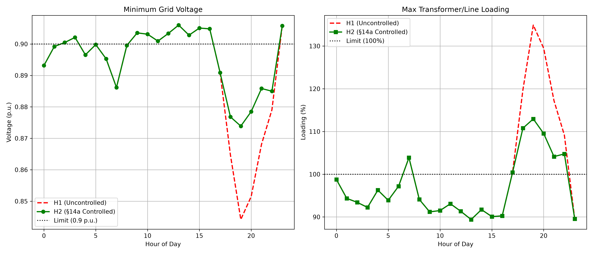

# ⚡ Smart Grid Impact Analysis: Netzintegration von EV, WP & BESS

## 📌 Projektbeschreibung
Dieses Projekt bietet eine umfassende simulationsbasierte Analyse der Auswirkungen moderner Lasten und Prosumer-Technologien auf das elektrische Verteilnetz (Niederspannung). Der Fokus liegt auf der **Sektorenkopplung** und der Untersuchung von Netzengpässen durch den Hochlauf von Elektromobilität (EV) und Wärmepumpen (WP) sowie der **netzdienlichen Integration** von Photovoltaik (PV) und Batteriespeichersystemen (BESS) durch Home Energy Management Systems (HEMS) gemäß §14a EnWG.

Das Projekt wurde mit der Open-Source-Bibliothek `pandapower` in Python entwickelt.

## 📁 Projektstruktur (Repository Structure)
Um eine saubere Trennung von Code und Ergebnissen zu gewährleisten, ist das Repository wie folgt aufgebaut:
- `src/` : Enthält alle ausführbaren Python-Skripte für die Simulationen.
- `outputs/` : Enthält alle generierten Diagramme, Plots und Analyseergebnisse.

## 🎯 Hauptmerkmale (Key Features)
- **Szenariobasierte Lastflussberechnung (Time Series Analysis):** Simulation von 24-Stunden-Profilen für Basislasten, EV-Ladevorgänge und Wärmepumpen.
- **Entkoppelte Analyse (Decoupled Analysis):** Isolierte Betrachtung der Spannungsabfälle, um den genauen Einfluss einzelner Technologien (z. B. der 11-kW-EV-Ladung vs. 3-kW-Wärmepumpe) zu quantifizieren.
- **PV & BESS Integration (Smart Prosumers):** Implementierung einer HEMS-Logik zur Netzentlastung:
  - *Überschussladen:* Vermeidung von Überspannung am Mittag durch Einspeicherung der PV-Spitze.
  - *Lastspitzenkappung (Peak Shaving):* Vermeidung von Unterspannung und Transformatorüberlastung in den Abendstunden durch BESS-Entladung.

## 📊 Ergebnisse & Visualisierung
Die Simulationen zeigen deutlich, wie ungesteuerte EV-Ladevorgänge in den Abendstunden zu kritischen Spannungsabfällen (unter 0,85 p.u.) und Transformatorüberlastungen führen können. Durch die netzdienliche Integration (§14a EnWG & BESS) werden diese Netzengpässe effektiv eliminiert.

*Vergleich: Ungesteuertes Laden (H1) vs. Gesteuertes Laden nach §14a (H2)*

*(Weitere Diagramme und detaillierte Auswertungen wie `PV_BESS_Integration.png` oder `EV_vs_HP_Impact.png` finden Sie im Ordner `outputs/`)*

## 🛠️ Technologien & Stack
- **Programmiersprache:** Python
- **Netzsimulation:** `pandapower`, `networkx`
- **Datenverarbeitung:** `pandas`, `numpy`
- **Visualisierung:** `matplotlib`, `seaborn`

## 🚀 Installation & Nutzung

1. **Repository klonen:**

   git clone https://github.com/sharifianhamid61-del/Sektorenkopplung-Netzintegration
   cd SmartGrid-Impact-Analysis

👨‍💻 Autor
Hamid Sharifian

M.Sc. Electrical Power Engineer | Experte für Power Grid Analytics & Geospatial Analysis

💼 [LinkedIn Profil](https://linkedin.com/in/hamid-sharifian-4b349052)
🎓 [Google Scholar](https://scholar.google.com/citations?user=PsIZ3g50uOAAAAJ)
📧 sharifian.hamid61@gmail.com
